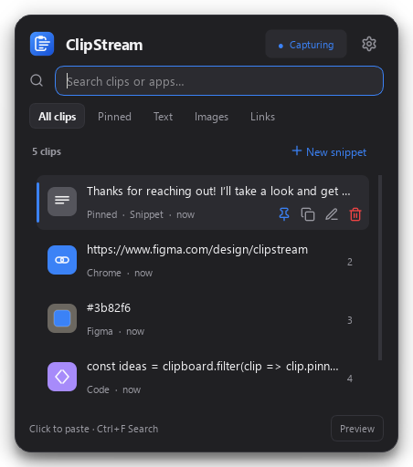

<p align="center">
  
</p>
<h1 align="center">ClipStream</h1>
<p align="center">Your clipboard, with a memory.</p>
<p align="center">
  A fast, native Windows clipboard manager. Find it. Preview it. Paste it.
</p>
<p align="center">
  <a href="https://github.com/Razee4315/clipstream/releases/latest"></a>
  
  <a href="LICENSE"></a>
</p>
<p align="center">
  
</p>

## Get started

[**Download ClipStream for Windows →**](https://github.com/Razee4315/clipstream/releases/latest)

Run the installer, copy something, then press **Ctrl+Shift+V** and click a clip to paste it.
ClipStream stays in your system tray.

## Made for your everyday copy & paste

- **Paste right where you were.** The popup opens without taking focus, so your app and selection stay put. One click, or **Enter**, replaces the selection.
- **Find anything faster.** Search text or app names; filter pinned clips, text, images, and links.
- **Keep the useful bits.** Pin favourites, save reusable snippets, and preview full clips before pasting.
- **Do more with a clip.** Open links and files, change text case, convert colours, or paste a calculation result.
- **Stay in control.** Pause capture, exclude apps, set retention, and mask detected secrets. Clips that password managers mark as private are never saved. History stays on your device.
- **Feel at home.** Native C++ / Qt 6, keyboard navigation, and eight theme options including System.

## Shortcuts

| Action | Shortcut |
| --- | --- |
| Open / close | **Ctrl+Shift+V** |
| Navigate / paste | **↑ ↓** / **Enter** |
| Quick-paste a clip | **Ctrl+1–9** |
| Preview / pin | **Ctrl+Space** / **Ctrl+P** |
| New snippet / search | **Ctrl+N** / **Ctrl+F** |
| Format on paste | **Shift+Enter** |

<details>
<summary>More shortcuts & building from source</summary>

**Ctrl+O** opens a link or file · **F2** edits · **Shift+Delete** deletes · **Esc** closes.

Typing goes to your app until you press **Ctrl+F** or click the search box. Windows
does not let a normal app paste into one running as administrator; ClipStream then
leaves the clip copied and tells you to press **Ctrl+V**.

Requires Qt 6 (MinGW kit, including SVG and Test), CMake, and Ninja on `PATH`.

```powershell
cmake -S . -B build -G Ninja -DCMAKE_BUILD_TYPE=Release -DCMAKE_PREFIX_PATH="C:/Qt/6.11.1/mingw_64"
cmake --build build
ctest --test-dir build --output-on-failure
```

Tests use a temporary database and offscreen clipboard. UI screenshots are saved
in `build/artifacts/`. Real focus and paste behaviour has a separate desktop check;
see [Contributing](CONTRIBUTING.md).

</details>

---

Made by [Saqlain Abbas](https://www.linkedin.com/in/saqlainrazee/) · [MIT](LICENSE) · [Changelog](CHANGELOG.md) · [Report a bug](https://github.com/Razee4315/clipstream/issues)
